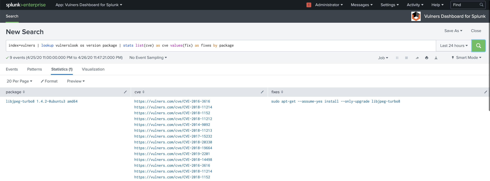
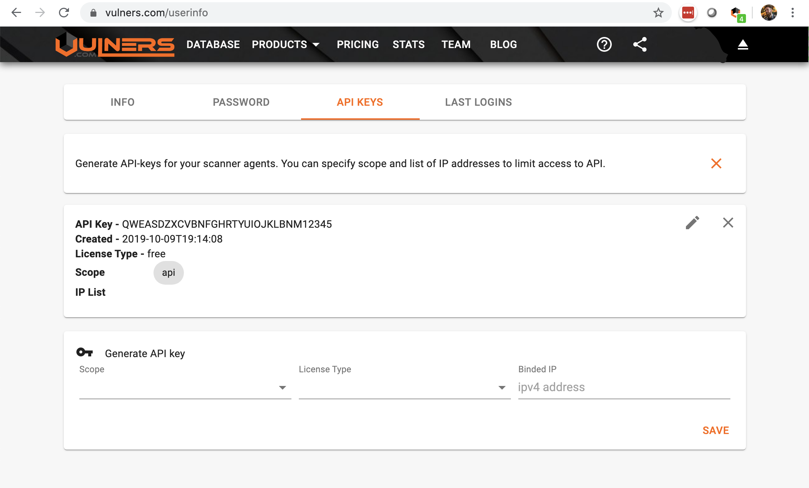
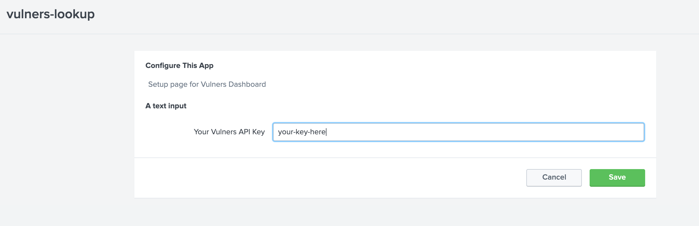
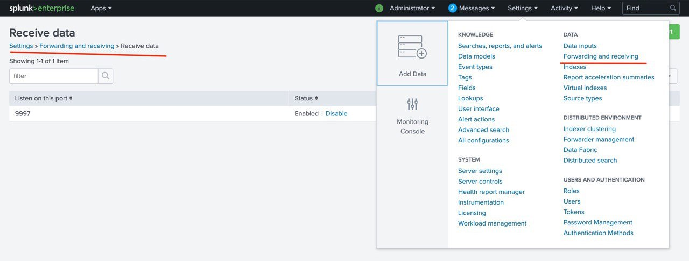

# Splunk - Vulners App

Vulners Application for Splunk allows one to use Splunk as a Vulnerability assessment platform and security scanner.


### Notes
- Current [Distro](./result/vulners-lookup-0.0.1.tar.gz) was created on a single machine environment. It was tested in a simple installation with one indexer and search head on a single machine as well. As a result it is a whole package that includes parts for all three Splunk components: forwarder, indexer and search head. 
- In spite of Splunk official documentation for [AppInspect](https://dev.splunk.com/enterprise/docs/releaseapps/appinspect/appinspectreferencetopics/splunkappinspectcheck/#Indexesconf-file-standards) claiming no indexes definitions are allowed, this package still has [one](./vulners-lookup/default/indexes.conf) for easier use in a single machine installation. Note that you will have to delete the file and create a new index with the same name on your indexer if you have a separate one (step 4 in the installation process below).
- The following installation process is a straightforward one for a case without indexers and uses the provided package as is. The package has however been tested against generating deployment units, look at [generate DU](#using-slim) for a quick reference.


## Installation

### Dashboard App

#### 1.1 Install 
In Splunk dashboard on your search-head go to 

    Apps -> Install app from file -> choose [vulners-lookup-*.tar.gz](./result/vulners-lookup-0.0.1.tar.gz)

then [restart](https://docs.splunk.com/Documentation/Splunk/8.0.3/Admin/StartSplunk) Splunk Enterprise

 
#### 1.2. Add Vulners-API key

 - get API key at https://vulners.com/
  
  
 - add key in Splunk Vulners Dashboard 
 


#### 1.3 Create vulners index
Since the forwarder app forwards data to the index named **vulners**, it has to be present in the system. 
    
    Settings -> Indexes -> New Index

#### 1.(4) Add receiving port
If you are using Splunk for the first time, don't forget to Set data receiver 
    
    Settings -> Forwarding and receiving -> Configure receiving -> New Receiving port


---

### Forwarder App

#### 2.1 Install
Unpack vulners_lookup.tar.gz into **$SPLUNK_FORWARDER_HOME/etc/apps/**
 
#### 2.2 Python Libs
Install following Python libs on forwarder machines 
    ```bash
    pip3 install distro getmac ifaddr futures
    ```
and [restart](https://docs.splunk.com/Documentation/Forwarder/8.0.3/Forwarder/Starttheuniversalforwarder) Splunk Forwarder

#### 2.(3) Add forward server
If you are installing forwarder for the first time you have to [add forward-server](https://docs.splunk.com/Documentation/Forwarder/8.0.5/Forwarder/Configuretheuniversalforwarder#Configure_the_universal_forwarder_to_connect_to_a_receiving_indexer)

___

## Usage

#### 1. Seach for packages collected by forwarders
By default Forwarder is sending information about packages hourly or right after restart.
To see collected packages run search
```
index=vulners
```

#### 2. Run Vulners audit
Vulners application is running audit script automatically at 9 o'clock in the morning. 
Alternatively you can hit saved search
```
| savedsearch vulners_report 
```

#### 3. All collected data 


## Using [slim](https://dev.splunk.com/enterprise/docs/releaseapps/packagingtoolkit/installpkgtoolkit)
**NB** The process of DU creation has been tested and should work without issues. However no tests have been conducted regarding use of deployment server. Any feedback on that would be appreciated.

 - Install slim as in the instruction (take note of [this bug](https://answers.splunk.com/answers/773820/error-while-running-slim-partition-command.html) though)
 - Create a package
 ```
slim package -o result/ ./vulners-lookup/
```
 - Partition the package into deployment units
 ```
 slim partition -o deployment-units/ vulners-lookup-0.0.1.tar.gz
 ```
 - Use your deployment server for installation
 
 
 
